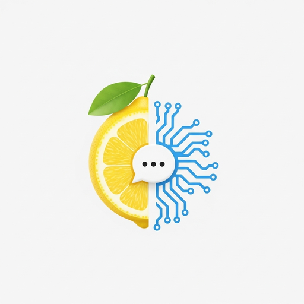

<p align="center">
  
</p>

<h1 align="center">🍋 Lemonade Conversation for Home Assistant</h1>

<p align="center">
  <strong>Integración de Lemonade Server como agente de conversación para Home Assistant</strong>
</p>

<p align="center">
  
  <a href="https://hacs.xyz"></a>
  
  
</p>

<p align="center">
  
  
  
</p>

<p align="center">
  Conecta tu servidor <a href="https://lemonade-server.ai">Lemonade</a> local como un agente de conversación totalmente funcional en Home Assistant.<br>
  Disfruta de control por voz/texto de tus dispositivos con <strong>privacidad total</strong> y <strong>cero dependencias en la nube</strong>.
</p>

---

## 🚀 Instalación Rápida

<p align="center">
  <a href="https://my.home-assistant.io/redirect/hacs_repository/?owner=pchdomotichome&repository=lemonade_conversation_ha&category=integration">
    
  </a>
  <a href="https://my.home-assistant.io/redirect/config_flow_start/?domain=lemonade_conversation">
    
  </a>
</p>

---

## ✨ Características

- 🤖 **Agente de Conversación Completo** - Integración nativa con Home Assistant Assist
- 🏠 **Control de Dispositivos** - Enciende/apaga luces y más mediante comandos naturales
- 🔍 **Consulta de Estados** - Pregunta por el estado de tus dispositivos en tiempo real
- ⚙️ **Configuración UI Completa** - Config Flow + Options Flow profesionales
- 🌐 **Multi-idioma** - Soporte para español, inglés y más
- 💬 **Chat Log Integrado** - Conversaciones persistentes
- 🔒 **100% Local y Privado** - Sin enviar datos a la nube
- ⚡ **Rápido y Eficiente** - Respuestas instantáneas

---

## 📦 Instalación

### Método 1: HACS (Recomendado)

**Opción A: Con un click** 🎯

Haz click aquí para agregar el repositorio a HACS:

[](https://my.home-assistant.io/redirect/hacs_repository/?owner=pchdomotichome&repository=lemonade_conversation_ha&category=integration)

**Opción B: Manual en HACS**

1. Abre HACS en Home Assistant
2. Ve a **Integraciones**
3. Haz clic en el menú de 3 puntos (arriba a la derecha)
4. Selecciona **Repositorios personalizados**
5. Agrega esta URL: `https://github.com/pchdomotichome/lemonade_conversation_ha`
6. Categoría: **Integración**
7. Busca "Lemonade Conversation" e instala
8. **Reinicia Home Assistant**

### Método 2: Manual

1. Descarga la carpeta `custom_components/lemonade_conversation`
2. Cópiala a tu carpeta `config/custom_components/`
3. **Reinicia Home Assistant**

---

## ⚙️ Configuración

### Agregar la Integración

Después de instalar y reiniciar, agrega la integración con un click:

[](https://my.home-assistant.io/redirect/config_flow_start/?domain=lemonade_conversation)

O manualmente:
1. Ve a **Configuración → Dispositivos y Servicios → Agregar Integración**
2. Busca "Lemonade Conversation"
3. Configura la URL de tu servidor Lemonade

### Requisitos Previos

- Home Assistant 2023.8 o superior
- Servidor Lemonade ejecutándose

### Configuración Inicial

1. **URL Base**: URL de tu servidor Lemonade (ej: `http://192.168.1.100:8000`)
2. **Modelo**: Nombre del modelo a utilizar (ej: `Qwen3-Coder-30B-A3B-Instruct-GGUF`)
3. **Temperatura**: Control de creatividad (0.0 - 2.0, default: 0.7)

### Opciones Avanzadas

Puedes ajustar estos parámetros desde **Configuración → Dispositivos y Servicios → Lemonade Conversation → Configurar**:

- **Temperature** - Controla la creatividad (0.0 = determinista, 2.0 = muy creativo)
- **Top P** - Nucleus sampling (0.0 - 1.0)
- **Top K** - Diversidad de respuestas (1 - 100)
- **Max Tokens** - Límite de longitud de respuesta (1 - 32768)
- **Prompt del Sistema** - Personaliza el comportamiento del asistente
- **Timeout** - Tiempo de espera en segundos (5 - 120)

---

## 💡 Ejemplos de Uso

### Consultas de Estado

```
"¿Qué luces están encendidas?"
"Dame el estado de las luces del bunker"
"¿Hay alguna luz encendida en la cocina?"
"¿Está encendida la luz del dormitorio?"
```

### Control de Dispositivos

```
"Enciende la luz principal del bunker"
"Apaga todas las luces del dormitorio"
"Podrías encender la luz de la cocina"
"Apaga la luz del salón"
```

### Conversación Natural

El asistente responde en lenguaje natural y mantiene contexto de la conversación:

```
Usuario: "¿Qué luces están encendidas?"
Lemonade: "Actualmente hay una luz encendida: la luz principal del bunker."

Usuario: "Apágala"
Lemonade: "He apagado la luz principal del bunker."
```

---

## 🔧 Configuración de Assist

1. Ve a **Configuración → Voz → Asistentes**
2. Crea un nuevo asistente o edita uno existente
3. En **Agente de conversación**, selecciona **Lemonade Conversation**
4. ¡Listo! Ya puedes usar comandos de voz

---

## 🛠️ Solución de Problemas

### No se puede conectar al servidor

- Verifica que el servidor Lemonade esté ejecutándose
- Comprueba que la URL base sea correcta (incluye `http://` y el puerto)
- Asegúrate de que Home Assistant pueda acceder a la IP/puerto del servidor

### El agente no responde

- Verifica los logs de Home Assistant
- Aumenta el timeout en las opciones
- Comprueba que el modelo especificado existe en tu servidor Lemonade

### Las luces no se controlan

- Asegúrate de que las entidades estén expuestas en Assist
- Ve a **Configuración → Voz → Asistentes → Exponer** y marca tus dispositivos

---

## 📝 Registro de Cambios

Ver [CHANGELOG.md](CHANGELOG.md)

---

## 🤝 Contribuir

Las contribuciones son bienvenidas! 

1. Fork el proyecto
2. Crea tu rama de características (`git checkout -b feature/AmazingFeature`)
3. Commit tus cambios (`git commit -m 'Add some AmazingFeature'`)
4. Push a la rama (`git push origin feature/AmazingFeature`)
5. Abre un Pull Request

Ver [CONTRIBUTING.md](CONTRIBUTING.md) para más detalles.

---

## 🐛 Reportar Problemas

Si encuentras algún problema, por favor [abre un issue](https://github.com/pchdomotichome/lemonade_conversation_ha/issues) con:

- Versión de Home Assistant
- Versión de la integración
- Logs relevantes
- Pasos para reproducir el problema

---

## 📄 Licencia

Este proyecto está bajo la Licencia MIT - ver el archivo [LICENSE](LICENSE) para más detalles.

---

## 🙏 Agradecimientos

- [Lemonade Server](https://lemonade-server.ai) por el increíble servidor LLM local
- Comunidad de Home Assistant por las herramientas y documentación
- Todos los contribuidores y testers

---

## 🔗 Enlaces

- [Documentación de Lemonade Server](https://lemonade-server.ai/docs/)
- [Home Assistant](https://www.home-assistant.io)
- [Reportar un problema](https://github.com/pchdomotichome/lemonade_conversation_ha/issues)

---

<p align="center">
  <strong>Desarrollado con ❤️ en Argentina 🇦🇷</strong>
</p>
